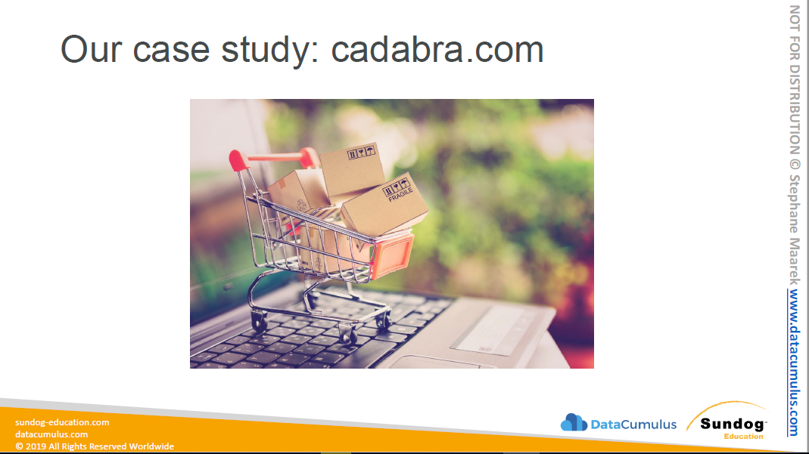
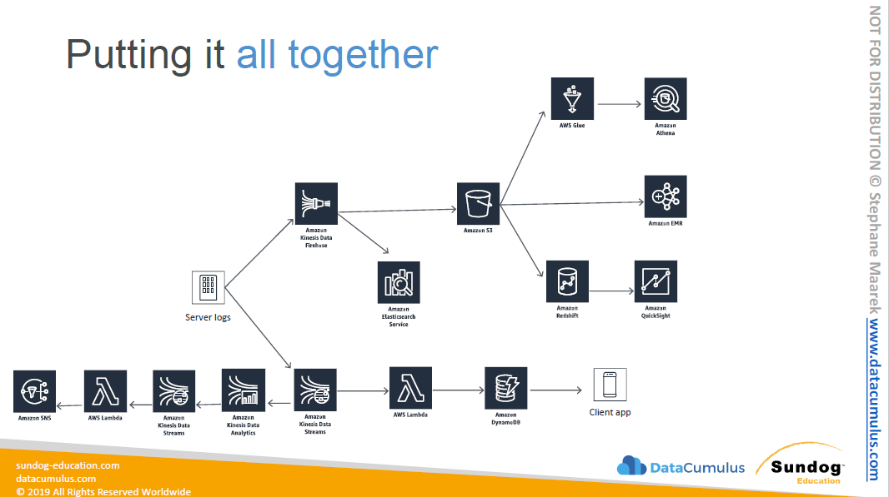

AWS Big Data Cadabra.com
====================
This repository contains the architecture for the Cadabra.com site, an huge e-commerce company.  
  
  
We're going to work through six different requirements for building up Cadabra.com  
* Requirement 1: Order history app
  * Kinesis Agent
  * Kinesis Firehose
  * EC2
  * S3
  * CloudFormation  
* Requirement 2: Product recommendations
* Requirement 3: Transaction rate alarm
* Requirement 4: Near-real-time log analysis
* Requirement 5: Data warehousing & visualization
* Requirement 6: Putting it all together
  
